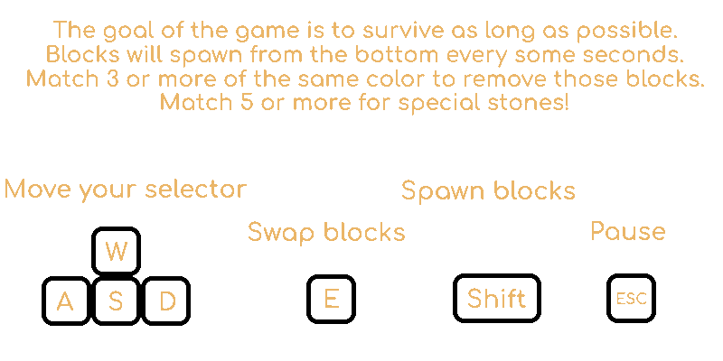
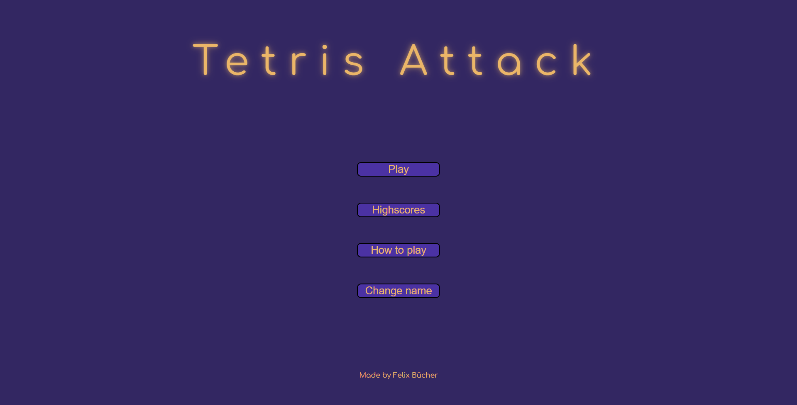
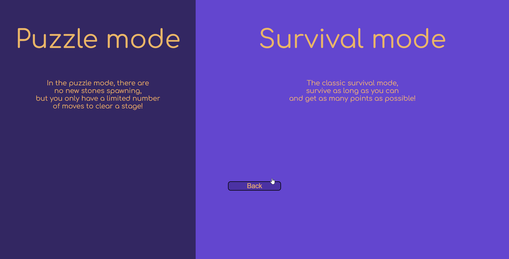
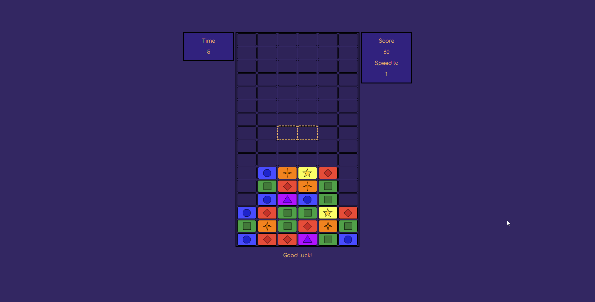
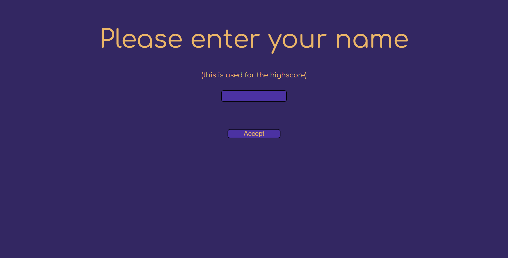
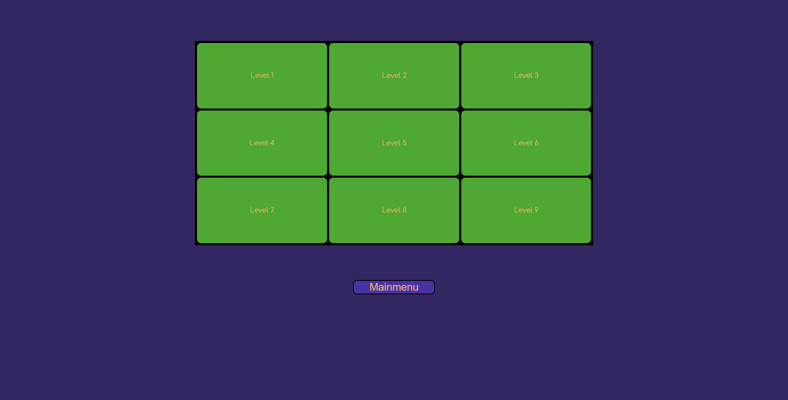

# Tetris Attack - Felix Bücher

## Beschreibung des Spiels

Dies ist eine Tetris Attack Einzelspielervariante, 
dem Spiel "Tetris Attack" von Nintendo aus dem Jahre 1995 für den SNES nachempfunden.

---

In meiner Variante gibt es 2 Modi, "Puzzle" und "Survial".

Puzzle ist hierbei ein Modus, indem der Spieler eine bestimme Anzahl an Spielzügen zur 
Verfügung hat, um alle Blocks auf dem Feld zu vernichten.
Dieser Modus ist dem Puzzle Modus des Original Spiels nachempfunden.
Derzeit gibt es 9 Puzzle, welche jedoch sehr einfach erweiterbar sind, 
mehr dazu in dem Bereich [Konfigurationen](#konfigurationen).

----

Survival ist ein Modus, der nicht in dem original Spiel existierte.
Da eine Anforderung war, ein solo Spiel zu entwickeln, und das Original eher
ein 1v1 Spiel ist, habe ich hier eine art Wettlauf mit der Zeit erstellt.
Blocks spawnen in bestimmten Intervallen nach, diese werde mit der Zeit immer und immer kürzer.
Desweiteren habe ich auch einen weiteren Block eingeführt, welcher dem Spieler
als Belohnung gegeben wird, sollte er 5 oder mehr Blocks in einer Reihe matchen.
Der Spieler kann auch manuell neue Blocks spawnen, dies bietet dem Spieler die Möglichkeit,
schnell mehr Matches zu erlangen, bevor das Spiel zu schnell wird, um so seine Punktzahl zu maximieren.

Sollte das Spiel vorbei sein, wird der Score über die freigegebene REST Schnittstelle in der 
redis Datenbank gespeichert, um diese dann später anzeigen lassen zu können.
Die vorhandenen Befehle zum abrufen der Scores und zum posten sind unter
[Curl Befehle Beispiele](#curl-befehl-besipiele) zu finden.

## Vorbereitung

Es sollte auf dem Kubernetes Cluster 2 Terminals geöffnet werden.

Im ersten Terminal sollte wie gewöhnlich die App postforwarded werden, und im zweiten einmal
der REST Service, damit die Highscores gespeichert werden, Befehlsbeispiele findet man 
[hier](#lens--kubernetes).


## Steuerung

Hierzu referiere ich auf mein erstelltes gif zur Steuerung, 
diese kann jedoch auch angepasst werden, siehe Bereich [Konfigurationen](#konfigurationen).




## Konfigurationen

Das Spiel ist konfigurierbar über die File "config.dart" zu finden unter "lib/util/".
Einstellbare funktionen:
- REST Service port und ob localhost oder nicht
  - Standard rest port 5000 und localhost = true
- Timer
  - Falls einem das Spiel zu schnell / zu langsam ist.
  - Es ist empfohlen diese zu lassen wie sie sind.
- Anzahl Puzzle Level
  - Standard 9, kann jedoch erweitert werden, es müssen jedoch für alle Level die
  erforderlichen json files erstellt werden, dies ist jedoch das Einzige was machen müsste.
- Eradicator Block erlauben.
  - Standard true
- Steuerung
  - Kann nach Belieben angepasst werden.
- Scores
  - Falls man lieber größere Zahlen sehen will.

## Screenshots

### Index page


### Mode selection page


### Game page


### Highscore mit REST Schnittstelle aktiv und nur 2 Einträgen
Die Tabelle passt sich von der Größe an die Menge der Spieler an, es wird nur die top 10 angeziegt.


### Change name page


### Stage selection page (Alles cleared)



## Relevante Befehle

### Lens / Kubernetes:

#### Befehl zum forwarden des webservers:
```
kubectl port-forward svc/master-webapp-svc 8000:80
```

#### Befehl zum forwarden der rest api:
```
kubectl port-forward svc/rest 5000:80
```
---
### Curl Befehl Besipiele:

#### Die systemvorinstallierte Instanz curl entfernen damit wir das richtige curl benutzen können
```
remove-item alias:curl
```

#### OPTIONS
```
curl -X OPTIONS http://localhost:5000/highscore
```

#### PUT / POST
```
curl -X POST -d "uid=123" -d "name=player1" -d "score=12" http://localhost:5000/highscore
```

#### GET
```
curl http://localhost:5000/highscore                  |   (top 10 scores)
curl -d "uid=123" http://localhost:5000/highscore     |   (spezifischer score)
```

#### DELETE
```
curl -X DELETE -d "uid=123" http://localhost:5000/highscore
```
